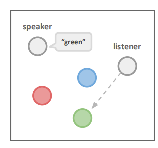
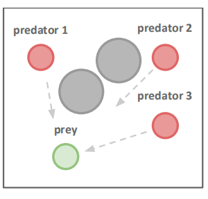
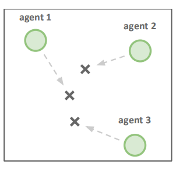
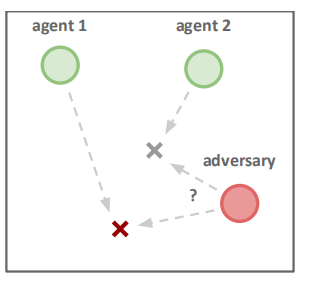
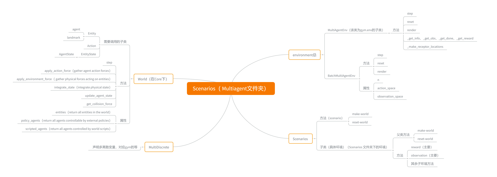
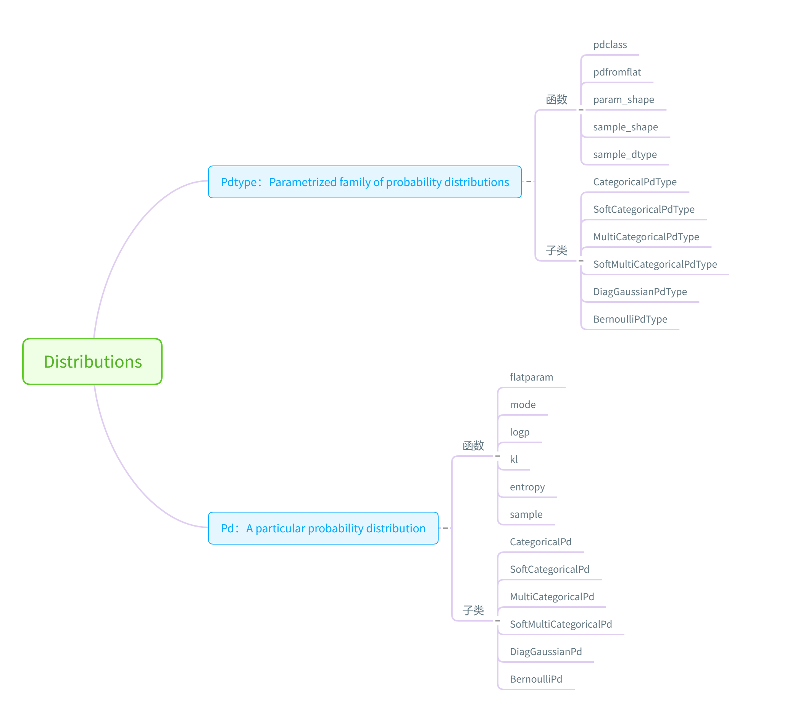

[TOC]

# 深度解析MADDPG

## MADDPG原理

OpenAI 2017论文[《Multi-Agent Actor-Critic for Mixed Cooperative-Competitive Environments》](https://arxiv.org/abs/1706.02275)

[知乎](https://zhuanlan.zhihu.com/p/53811876)已经比较详细介绍了

本文主要分析该开源程序的架构。

该程序主要是对 文章中的environment的实验进行房展

在试验中 存在 agent 和landmarks 

实验一：speak 不能动 但是可以看，listener说一个颜色 listener 就到一个颜色的landmark上去

 


实验二：在这种经典的捕食者-食饵游戏变体中，N个较慢的Predator在Landmark阻碍下追赶速度更快的Prey

每一个Predator碰撞到prey，代理人得到奖励，而对手受到惩罚。



实验三 agent必须通过进行合作，以达到Landmark。必须躲避其他agent 到达相同的地标。



实验四：N个agent要到N个landmark上去，然而，一个adversary也希望到达目标地标，这个adversary不知道哪个地标是正确的。agent 根据adversary到正确地点的距离受到负reward。



算法[github](https://github.com/openai/maddpg) 

环境[github](https://github.com/openai/multiagent-particle-envs)


## 程序架构

强化学习的主要两个部分即 环境 和 算法

环境 主要是通过 主函数中 make-env创建

```python
def make_env(scenario_name, arglist, benchmark=False):
    from multiagent.environment import MultiAgentEnv
    import multiagent.scenarios as scenarios

    # load scenario from script
    scenario = scenarios.load(scenario_name + ".py").Scenario()
    # create world
    world = scenario.make_world()
    # create multiagent environment
    if benchmark:
        env = MultiAgentEnv(world, scenario.reset_world, scenario.reward, scenario.observation, scenario.benchmark_data)
    else:
        env = MultiAgentEnv(world, scenario.reset_world, scenario.reward, scenario.observation)
    return env
```


算法 主要是通过主函数中 get_trainers创建

```python
def get_trainers(env, num_adversaries, obs_shape_n, arglist):
    trainers = []
    model = mlp_model
    trainer = MADDPGAgentTrainer
    for i in range(num_adversaries):
        trainers.append(trainer(
            "agent_%d" % i, model, obs_shape_n, env.action_space, i, arglist,
            local_q_func=(arglist.adv_policy=='ddpg')))
    for i in range(num_adversaries, env.n):
        trainers.append(trainer(
            "agent_%d" % i, model, obs_shape_n, env.action_space, i, arglist,
            local_q_func=(arglist.good_policy=='ddpg')))
    return trainers
```


在每一次迭代中，都会计算所有agent的动作

然后将所有agent的动作送入 step ，并得到reward ，在这里reward对agent都是相同的。

每一个agent都拥有自己的经验池，并将所有的都进行更新。

同样每次都对所有的agent都运行一遍update


## ENV 部分



<center>总体概况图<center>


在ENV的部分调用过程中，都是通过调用具体环境，即Scenario下的子类环境，然后用该场景下的两个方法

Make-world 和 reset-world。创建具体的环境。

总体流程是 

1. 调用环境 make-env（train）
2. **具体环境建立**
3. Make-world 创建 agent 初始化各个agent
4. reset-world初始化各个agent
5. **创建env** 
6. 为每个agent创建 状态-动作空间
7.  **step 和reward等环境**

### 具体子环境

#### Make_World

创建过程中

1、循环调用core中的agent 向 world 中增加 agent 和 landmark 

agent 包含以下参数

+ movable： True or Flase 可以不可以移动 
+ silent ：True or Flase       可以不可以交流
+ Bline  ：True or Flase       可以不可以观察
+ Unoise、Cnoise ：True or Flase  U动作噪声 C 交流噪声
+ state 状态
+ action 动作

2、world 中定义了 agent运动的基本方式，主要利用两个函数

+ apply_action_force： 将动作加上噪声
+ apply_environment_force ：将agent的 运动 加在状态上，需要通过get_collision_force判断是不是碰撞
+ integrate_state  ： 求积分 更改 将速度增加在 P上
+ update_agent_state：将交流动作加上噪声

#### reset world

利用循环将各个agent  的动作 通信动作 初始化

####   此外此函数中定义奖励 和 观察

### Environment

将world 输入到 MultiagentEnv或者BatchMultiAgentEnv 以创建

该函数的输入是  

```python
world=Scenario.make_world()
reset_callback=scenario.reset_world, 
reward_callback=scenario.reward,
observation_callback= scenario.observation,
info_callback=scenario.done
done_callback=None, 
shared_viewer=True
```
该环境下存在 reset 和 step函数 

该step也是调用 world 下的 step , 但是该处的step可以确定agent的动作顺序

```python
for i, agent in enumerate(self.agents):
    self._set_action(action_n[i], agent, self.action_space[i])
```

## Trainer

在这里每一个agent都需要建立一个trainer ，然后添加在在trainer list中

```python
trainer(name = "agent_%d" % i, model = model, 
        obs_shape_n =  [env.observation_space[i].shape for i in range(env.n)]   
        # env.n 是agent的个数 这个地方传进去一个list
        env.action_space =  env.action_space，i = agent的序号，arglist=None
        local_q_func = (arglist.adv_policy=='ddpg'))
```

 其中最主要关注的是model，obs_shape_n， env.action_space 

其中输入model是一个 网络，这个网络即是critic 又是actor

```python
def mlp_model(input, num_outputs, scope, reuse=False, num_units=64, rnn_cell=None):
    with tf.variable_scope(scope, reuse=reuse):
        out = input
        out = layers.fully_connected(out, num_outputs=num_outputs, activation_fn=None)
        return out
```

---

**Trainer **主要包含

一个类：MADDPGAgentTrainer  在该类中调用P—train，Q—trian，利用function来建立所利用的函数。

四个子函数：

- P—train
- Q—trian
- discount_with_dones
- make_update_exp

**主要是依赖于tensorflow的function建立的**


### P_train  主要是为了建立actor

总体思路流程是 建立actor  建立 critic  然后将critic 的输出 和 actor输出 当做loss 来训练actor

```python
self.act, self.p_train, self.p_update, self.p_debug = p_train(scope=self.name,  
    make_obs_ph_n = obs_ph_n,  act_space_n = act_space_n,  
   # 所有agent的状态空间 一个个tensor      所有agent的动作空间（list）
    p_index=agent_index，
    p_func = model,    q_func = model,
   # 创建actor 和 critic                                                   
    optimizer=tf.train.AdamOptimizer(learning_rate=args.lr),         # 优化算法
    grad_norm_clipping=0.5,
    # 梯度修剪
    local_q_func=local_q_func， num_units=args.num_units)
```

程序流程

将动作空间创建为概率分布。

为动作空间的概率分布和状态空间生成placeholder

生成actor   $P$      并得到$ P$ 可训练函数

```python
p = p_func(p_input,(状态的placeholder), 
           int(act_pdtype_n[p_index].param_shape()[0]), 
           scope="p_func", num_units=num_units)
p_func_vars = U.scope_vars(U.absolute_scope_name("p_func"))
```

这个地方P 是一个 输出层的tensor 

根据$P$ 输出的分布 采样 得到动作

并计算动作的均值  生成P-reg

act_pd  是把p这个function 传到其中，然后flatparam  又把这个地方取出来 然后 平方根 然后 求平均？  这个地方为什么要sample 两边？？


之后，将actor生成的action 与 状态 节课 送进去 生成 Q  critic  。

并将q的输出求均值 然后 得到总LOSS

```
loss = pg_loss + p_reg * 1e-3
```

 然后得到了 critic 部分 即 训练函数 train ，该函数是 输入是 状态和 动作 输出是loss

```
train = U.function(inputs=obs_ph_n + act_ph_n, outputs=loss, updates=[optimize_expr])
```

同时也得到了act部分 即 训练函数 act 

在该函数下 同样生成target 网络 ，生成方式与 p的生成方式是一样的都是利用model 

更新target网络用的是

```
update_target_p = make_update_exp(p_func_vars, target_p_func_vars)
```

所以最终生成3个函数 act（actor）、train（critic） 、update_target_p（更新actor） 


### Q_train  建立critic

形式与P_trian一样 建立 critic  然后建立 traget critic  其Loss 表示为 

如果用本地Q函数的时候   loss 利用本地数据 

```
loss = tf.reduce_mean(tf.square(q - target_ph))
```

 建立train的时候，不论是不是输入的 是不是 local 但是都是利用 全局数据

```python
train = U.function(
				inputs=obs_ph_n + act_ph_n + [target_ph], 
				outputs=loss, 
				updates=[optimize_expr])
q_values = U.function(obs_ph_n + act_ph_n, q)
```

Train 也输出的是Loss  而不是Q值 .

其他与之前类似。

### 主体部分 MADDPGAgentTrainer

利用p-train 创建actor  利用Q train 创建critic  调用replay buffer 创建经验回放池

利用经验回放来收集数据

```
self.replay_buffer.add(obs, act, rew, new_obs, float(done))
```

update

在更新的时候先计算每一个样本的target q 然后输入 Q和P的train 训练。


## 参数 以及 分布

在train开始的时候，程序把不同种类的动作建立成了各种不同的分布。 最后的动作输出的是分布，根据分布最后采样得到输出值。

+ Box 连续空间->DiagGaussianPdType （对角高斯概率分布）
+ Discrete离散空间->SoftCategoricalPdType（软分类概率分布）
+ MultiDiscrete连续空间->SoftMultiCategoricalPdType （多变量软分类概率分布）
+ 多二值变量连续空间->BernoulliPdType （伯努利概率分布）



### PdType

一个大类 下面有5个可以被继承函数 和5个子类 


name | Box |Discrete|MultiDiscrete|MultiBinary|暂时没有对应|暂时没有对应
:--: | :-: | :-:  | :-: | :-: | :-: | --- 
pdclass（返回的是类）  |DiagGaussianPd | SoftCategoricalPd | SoftMultiCategoricalPd | BernoulliPd|CategoricalPdType|MultiCategoricalPdType
pdfromflat（返回带输入的类） | pdclass（）（flat） |pdclass（）（flat）|带有low 和 high的参数的Pdclass|pdclass（）（flat）|pdclass（）（flat）|带有low 和 high的参数的Pdclass
param_shape |2倍输入变量size|size|size|size|size|size
sample_shape |size|size|size|size|size|size
sample_dtype|tf.float32|tf.float32|tf.float32|tf.int32|tf.int32|tf.int32

子函数必须有的函数

+ **sample_placeholder**

  为创建图中的placeholder 

+ **param_placeholder**

  为 创建图中的placeholder 

### Pd

|           | CategoricalPd | SoftCategoricalPd | MultiCategoricalPd | SoftMultiCategoricalPd | DiagGaussianPd |BernoulliPd |
| --------- | ---- | ---- | ---- | ---- | ---- | --------- |
| init | 输入tensor | 输入tensor |      |      | 从tensor 分离出均值 和 方差 |计算sigmoid（tensor）|
| flatparam | 返回输入tensor | 返回输入tensor |      |      | 返回输入tensor |返回输入tensor|
| logp | 返回tensor中最大的那个的位置 | 输出softmax（输入tensor） |      |      | 返回均值 |使变量变0 或者变1|
| logp | 计算稀疏softmax交叉熵 | 计算稀疏softmax交叉熵 | 计算稀疏softmax交叉熵 | 计算稀疏softmax交叉熵 | 计算稀疏softmax交叉熵 |计算稀疏softmax交叉熵|
| KL | 计算与目标的KL散度 | 计算与目标的KL散度 | 计算与目标的KL散度 | 计算与目标的KL散度 | 计算与目标的KL散度 |计算与目标的KL散度|
| entropy | 交叉熵 | 交叉熵 | 交叉熵 | 交叉熵 | 交叉熵 |交叉熵|
| sample | 输入tensor 采样 | 输入tensor 采样 | 输入tensor 采样 | 输入tensor 采样 | 输入tensor 采样 |输入tensor 采样|


