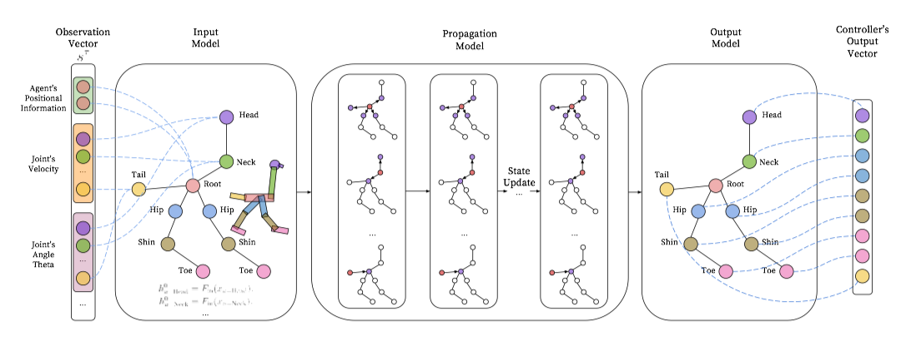

# 强化学习-最前沿之NeverNet

2009年，图神经网络首先被提出。这两年大热大火的图神经网络也在2018年ICLR上首次被运用在了强化学习当中，并命名为NeverNet，到今天已经有众多文章跟进了该方向。

该文章的的原文链接 和 源代码如下：

源文章：https://openreview.net/pdf?id=S1sqHMZCb

源码：https://github.com/WilsonWangTHU/NerveNet

### Motivation

该文作者首先看到在机器人控制过程中，存在着天然的离散图关系，所以文章中将各个机器人的几个可控制部位建立成图中的节点，机器人关节之间的关系为边。那么利用图神经网络将每一个节点建立成一个agent ，然后让不同agent的观察通过图中节点与节点之间的边进行传播，并用此种结构来学习正确的特征，而减少过拟合。

### NeverNET

文章中，作者用MuJoCo中的Walker-Ostrich作为环境，在这个环境中作者建立了下图中的图，其中能控制的节点（node）有Neck、Head、Tail、Hip、Shin、Toe ，除此之外，还建立了一个中心的节点来输入机器人的位置信息。节点的边（edge）也就是节点与节点之间的关系。文中作者考虑了无向图，并没有考虑有向图。

文章中对所有的节点都进行了分类，在文章的例子中主要有三类节点是 body、joint、root 。同样每个边都有一类

#### 结构

与神经网络类似，NeverNet主要也是利用神经网络的多层级联的结构。

##### 输入层

在每个step中 , 都会得到每个可操控关节的观察值$S_\tau$，将该观察值进行分解，分别放入对应的节点当中，作为输入值$x_u$，这样可以得到输入层为：
$$
h_{u}^{0}=F_{\mathrm{in}}\left(x_{u}\right)
$$
 其中，$F_{in}$为一个可以是一个多层神经网络。

##### 传播层

传播层主要是对标CNN，分为两层，第一层主要是传播（卷积）和聚合（池化）：

**传播**（卷积）：将上一层的周围节点的数据通过边进行传输。（注原论文中这个公式中是h的下标是$u$，但是我看了源代码 觉得应该是$v$）
$$
m_{(u, v)}^{t}=M_{c_{(u, v)}}\left(h_{v}^{t}\right)
$$
这一次传播，对与 相同类型的边，利用同样的神经网络进行正向传播得到。

**聚合（池化）**：池化将周围节点的数据利用聚合（池化）函数（也就是将周围节点的上一层的数据进行max、average、sum得到结果）
$$
\overline{m}_{u}^{t}=A\left(\left\{h_{v}^{t} | v \in \mathcal{N}_{i n}(u)\right\}\right)
$$
第二层是状态转移：直接利用传播和聚合的数据经过一个神经网络（可以是LSTM或者全连接网络，因为该网络利用PPO算法，所以相当于没利用经验回放，直接是一个epoch的数据，可以直接利用LSTM），最后得到该层的输出。
$$
h_{u}^{t+1}=U_{p_{u}}\left(h_{u}^{t}, \overline{m}_{u}^{t}\right)
$$

##### 输出层

在输出层每一个图中的节点都利用最后一个隐藏层数据输出一个高斯策略，也就是输出高斯分布的均值。
$$
\mu_{u \in \mathcal{O}}=O_{q_{u}}\left(h_{u}^{T}\right)
$$
同样，作者发现可以用一个相同的输出层对不同的节点，而不损失性能（这点有点怀疑）。

#### 算法

在学习算法这一块，作者利用最新的PPO作为基础的强化学习算法，但是架构中分为三种：

+ 利用之上建立好的GNN作为policy network，再利用一个全连接作为value network
+ 利用之上建立好的GNN作为policy network，再利用另一个结构的GNN作为value network
+ 利用之上建立好的GNN作为policy network，value network共享GNN权重，只是在输出层不同。

根据作者的结果看出，前两个表现的较好，最后一个不好，给出的原因可能是PPO惩罚项因子$\alpha$ 可能会有比较大的影响。

#### 总结

其实这个文章看起来图结构的影响是只是在隐藏层中，也就是将传统的隐藏层中加了根据图进行信息传播的信息传播和信息聚合。其实从仿真结果上来，作者更想说明图结构在multi-task 和 transfer learning上的有效性。感觉挖掘图结构所带来的增益并不是很大。

