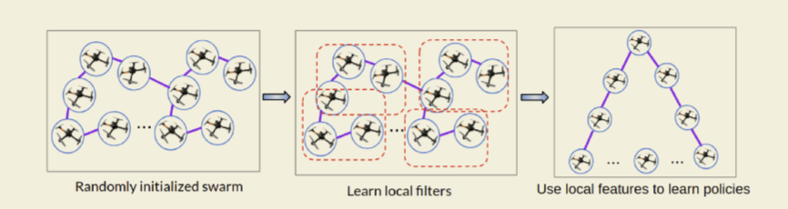

# 2019-10-03-强化学习_最前沿之grpah_policy_gradients

图神经网络与强化学习的结合已经成最近比较热门的方向，成为解决多agent的一个方向，这篇文章讲多个agent 建立成多个网络的节点，从而训练学习，完成任务。

这片博文主要关注的是2019年新的论文：Graph Policy Gradients for Large Scale Robot Control

这里先看看简单的

论文原文：https://arxiv.org/abs/1907.03822

## Motivation

首先文章中考虑的是多个机器人的控制问题，为了让所有的机器人学会有效的控制策略，机器人要学会与周围的一个子集的其他机器人进行交互，从而能更好的做出决策。通常来说CNN只是一种出路，CNN利用线性局部滤波的方法提取局部特征，但是CNN无法处理不规则的数据架构。所以图卷积神经网络GCN被提出了当作运用在多个agent的交互中。

##问题和模型

文章中首先所考虑的问题是多个无人机的飞行控制问题。多个无人机需要进行协同，然后飞行到固定的位置的问题。在一开始的时候无人机的位置是随机的，最后要飞行到一个固定的位置去。

首先讲无人机建模成为一个图结构，其中$G=(V,E)$，这里就定义V是无人机，而边是当两个无人机的距离小于一个值$e$的时候，就在这两个无人机之间建立一条边。之后 无人机就要利用GCN去对每一个节点生成一个独立的策略$\pi$，去生成该无人机的动作。

在这个问题中，文章假设所有无人机都是一样的，也就是说所有agent 享受有相同的动作空间和状态空间，除此之外，还具有相同的转移概率。

模型中，动作是位置的变化量，状态是就是无人机位置，在这里有两个约束，其中一个是不能碰撞：
$$
E_{c}\left(\mathbf{p}_{i t}, \mathbf{p}_{j t}\right)>\delta, \forall i \neq j \in\{1, \ldots N\}, \forall t
$$
其中$\mathbf{p}_{i t}$是无人机的位置，$\mathbf{p}_{j t}$是无人机的目标位置，$ E_{c}$是求欧式距离。还有一个是任务完成约束，即：
$$
\phi_{i j}(t)=\left\{\begin{array}{ll}{1,} & {\text { if } \forall i=j, E_{c}\left(\mathbf{p}_{i t}, \mathbf{g}_{j}\right) \leq \epsilon} \\ {0,} & {\text { otherwise }}\end{array}\right.
$$
其中，$\mathbf{g}_{i}$是无人机的目标位置。

单个无人机的奖励为：
$$
r(t)=\left\{\begin{array}{ll}{-\beta,} & {\text { if any collisions, }} \\ {-\sum_{i}^{N} E_{c}\left(\mathbf{p}_{i t}, \mathbf{g}_{i}\right)} & {\text { otherwise }}\end{array}\right.
$$
整个系统的奖励是所有无人机的奖励之和， 即：
$$
\sum_{n=1}^{N} \max _{\theta} \mathbb{E}_{\Pi}\left[\sum_{t}^{T} r_{t}\right]
$$

### 图卷积神经网络及强化学习网络架构

有关图卷积神经网络的知识，请参阅其他卷积神经网络的论文，不是这个论文的重点。文章采用的卷积操作，是2017年TSP的一篇文章的卷积操作，即：
$$
\mathbf{z}=\sum_{k=0}^{K} h_{k} \mathbf{S}^{k} \mathbf{x}=\mathbf{H}(\mathbf{S}) \mathbf{x}
$$

其中$\mathbf{S}$为图的laplacian矩阵。

作者采用的这种形式的卷积操作与传统的卷积神经网络具有比较大的不同，因为其将信号x转到频谱域，但是并没有转回来。第二是将多个邻域的数据进行了加和（暂时没有看TSP论文之后看看这个卷积定义的）

其网络的创建，实际上是将多层全连接网络每一层的操作转化为上式定义的图卷积操作，然后经过非线性变化，然后输出下一层的结果，即：

$$
\mathbf{z}^{l+1}=\sigma\left(\mathbf{H}(\mathbf{S}) \mathbf{z}^{l}\right)
$$

算法利用较为基础的policy gridient 算法，对网络参数进行更新。
$$
\nabla_{\theta} J=\mathbb{E}_{\tau \sim\left(\pi_{1}, \ldots, \pi_{N}\right)}\left[\left(\sum_{t=1}^{T} \nabla_{\theta} \log \left[\pi_{1}\left(\mathbf{a}_{1 t} | \mathbf{x}_{1 t}, \mathcal{G}\right) \ldots \pi_{N}\left(\mathbf{a}_{N t} | \mathbf{x}_{N t}, \mathcal{G}\right)\right]\right)\left(\sum_{t=1}^{T} r_{t}\right)\right]
$$
由于这里相对于全连接网络，来看算法这里的卷积操作其实也是线性操作，因为其中的$\mathbf{S}$矩阵是常数，所以误差反向传播的问题应该是不大的。

总结其算法可以得到以下的伪代码（嗯 实在是没看懂他计算y是干啥的）

注：15式就是上面的梯度公式。

## 总结：

感觉是一种尝试，但是文章中还是没有彻底解决两个问题，

+ 当图非常大的时候计算传播会非常慢;
+ 图在变化的时候，能不能训练好。

虽然论文中证明了，图中任意两个节点换位置，并不改变神经网络的效果。但是这个证明着实是比较简单，没有什么实际内容。