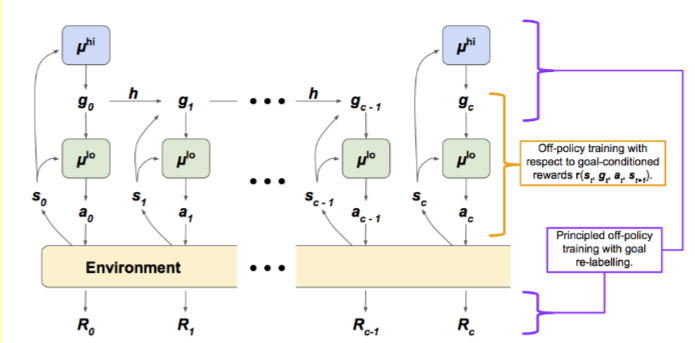

# 强化学习 最前沿之Hierarchical reinforcement learning（一）

分层的思想在今年已经延伸到机器学习的各个领域中去，包括NLP 以及很多representataion learning。

近些年，分层强化学习被看作更加复杂环境下的强化学习算法，其主要思想非常简单，就是一个大的问题进行分解。比如说我们需要完成一个课题，首先要应付写立项报告，去申请，然后再写中期答辩，最后再结题报告。那么分层强化学习也是一样的一个过程，其主要思路是依靠一个上层的policy去将整个任务进行分解，然后利用下层的policy去逐步执行。

目前已经有多篇文章在这个方面进行了卓有成效的研究：

这里已经有总结比较好的博文

[英文版](https://thegradient.pub/the-promise-of-hierarchical-reinforcement-learning/)

中文版 题目名为 强化学习遭遇瓶颈！分层RL将成为突破的希望。因为 都标明是原创，我也不知道到底是谁翻译的，大家可以直接去搜索 在这里就不给出地址了。

这里主要推荐三片文章：

2017年 ICML文章 提出封建网络FeUdal networks       [FeUdal networks for hierarchical reinforcement learning](https://arxiv.org/abs/1703.01161)

这篇文章也已经在CSDN上，有了解读 [传送门](https://blog.csdn.net/Charel_CHEN/article/details/78610857)

2018年NIPS文章 HIRO [Data-efficient hierarchical reinforcement learning](https://arxiv.org/abs/1805.08296)

2018 AAAI 的文章 [Learning Representations in Model-Free Hierarchical Reinforcement Learning](https://arxiv.org/abs/1810.10096)

**这篇博文主要来分析一下 2018年的NIPS的文章，HIRO**

## 分层强化学习

与前面的文章当中提出的结构是一样的，提出分层强化学习（HRL）利用多层策略，多层策略去训练和决策更高维度的行为和抽象决策，从而解决困难任务难以学习的问题。在多数文章中，任务被分成了2层，高层策略是去计划长时间的收益，而低层策略是为了直接与环境交互，达到高层策略所指定的目标。

分层强化学习也存在着3个重要的难点：

+ 怎么训练低层策略来感应语义存在不同的行为。
+ 怎么定义高层策略的动作

+ 怎么训练多个策略，在不过度收集数据的情况下。

## HIRO

HIRO从两个方面回答了这些问题：

general：构建一个两层框架，上级策略学习宏观策略，而下层策略只是做一个监督学习，学习上层所给出的目标。

efficient：将之前所有的HIRO从on-policy 转换为off-policy 。但是转化为off-policy的时候，存在一个问题就是，上层策略和下层策略都在发生变化，上层策略训练之后，对于相同的场景会产生与经验不一样目标，这样下层的动作也就发生变化。所以off-policy的问题在这里。

所以这个地方提出了off-policy correction 来解决上面的问题。

学习训练算法 文章使用的是DDPG ，对于DDPG不熟悉的同学来说，可以去看看莫烦的视频。

### off-policy corrections

为什么要有off-policy 矫正，off-policy存在一个问题，之前的经验拿到现在来进行训练，那么当时高层策略给出的目标，和现在高层策略给出的目标往往可能是不相同的。同样，对于相同的高层策略来说，给出同样的目标，那么过去的低层策略往往会做出和现在低层策略不一样的动作，这样就导致了环境给出的reward的变化，那么用这个reward去训练高层策略 往往是不准的。但是reward是改变不了的。

所以能改变的就是高层的动作，如果我们选择一个高层的动作，能够使得经验池中的已经得到低层动作的概率最大，就可以了
$$
\log \mu^{l o}\left(a_{t: t+c-1} | s_{t: t+c-1}, \tilde{g}_{t: t+c-1}\right) \propto-\frac{1}{2} \sum_{i=t}^{t+c-1}\left\|a_{i}-\mu^{l o}\left(s_{i}, \tilde{g}_{i}\right)\right\|_{2}^{2}+\text { const. }
$$
所以我们计算所有低层动作的概率，最后选择出来最大的来满足当前的结果。

### 正向传播

第一步 ： 环境给出state

第二步： 更高层的策略观察状态产生一个动作或者目标，这个动作或者目标 可以通过自身策略产生 也可以通过转移方程产生。这一步主要是为了产生一个暂时的抽象目标，因为高层决策是没C步产生一次。

这里要明确的一点是，并不是每一步都产生一个高节目标，高阶目标每隔c步产生一次。在这C步之间的动作都是通过一个函数h产生。
$$
h\left(s_{t}, g_{t}, s_{t+1}\right)=s_{t}+g_{t}-s_{t+1}
$$
第三步：低等级策略观察状态和目标产生一个动作，作用于环境。

第四步：环境根据低等级的动作 产生一个奖励，并转移到新的状态。 记录所有的数据。

### 反向传播

第一步： 从经验池收集数据

第二步：根据经验池的数据来生成每一步的奖励：
$$
r\left(s_{t}, g_{t}, a_{t}, s_{t+1}\right)=-\left\|s_{t}+g_{t}-s_{t+1}\right\|_{2}
$$
​				并训练低层的网络。

第三步：off-policy 的动作矫正，改变高层的动作。

第四步：训练高层 利用$\left(s_{t}, \tilde{g}_{t}, \sum R_{t: t+c-1}, s_{t+c}\right)$， 这里也就是将从$s_t$到$s_{t+c}$ 这一部分当作一条状态来进行学习。

## 总结

作者在Ant Gather、Ant Maze、Ant Push、Ant Fall 几个环境中验证了HIRO与Feudal Network和VIME，最后得到了算法效果远好于其他几个算法。

其实分层强化学习是不仅仅是解决复杂问题的，而且对于稀疏问题也是非常有帮助的，是非常好的发展方向，之后还会出关于这个方向的第二篇文章。

 

